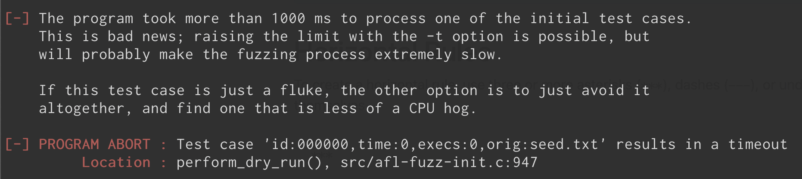
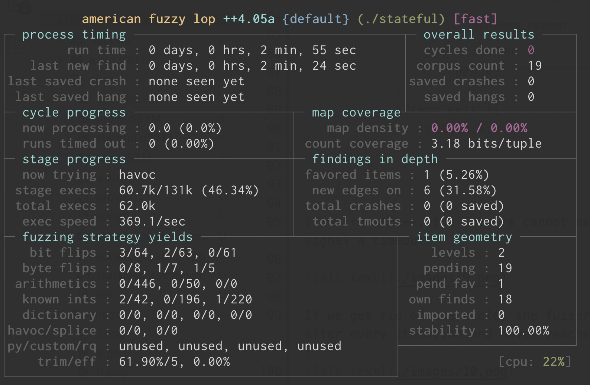
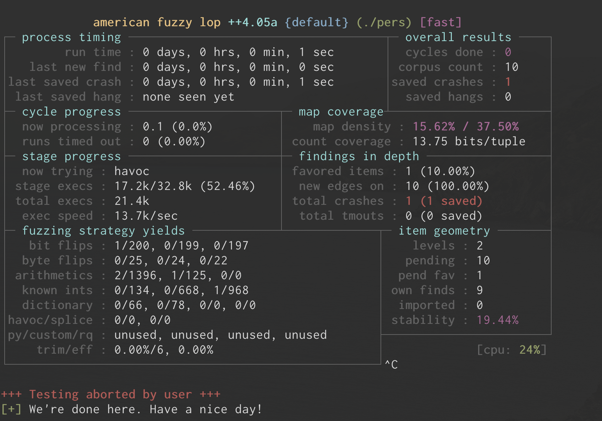
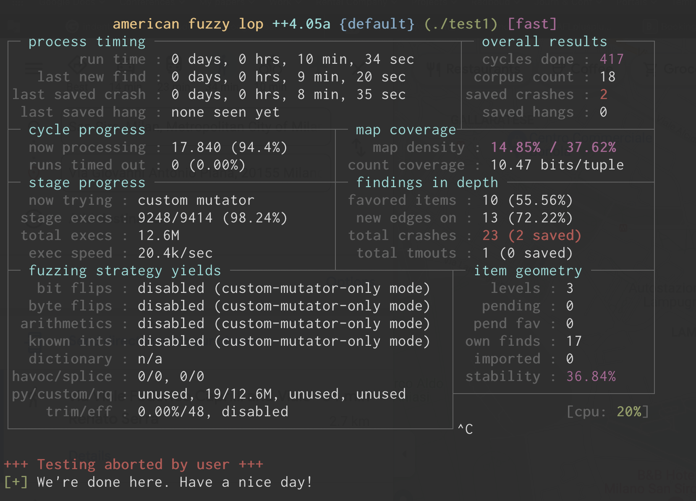

# 1. AFL++ for stateful systems

A stateful system is a system that keeps some internal state variable for its reasoning. Unlike the stateless ones, these particular systems follow some state model. If you want to have more detail, check out my paper on [stateful fuzzing](https://www.cristiandaniele.com/files/Papers/Fuzzers%20for%20stateful%20systems%20Survey%20and%20Research%20Directions.pdf).
When we want to fuzz a stateful system we have to send not only one message but multiple messages without resetting the SUT.
AFL++ offer a mode, the **PERSISTENT MODE**, that allows to not reset the SUT (Software Under Test). 
This mode is perfect when we have to deal with stateful systems.

### 1.1 Persistent mode on macOS

It's not trivial to run the persistent mode on the mac. You can take a look at this [blog](https://reverse.put.as/2017/07/10/compiling-afl-osx-llvm-mode/) or just try the following commands:

```
 > brew install llvm
 > LLVM_CONFIG=$llvm_path/llvm-config       
 > xcode-select --instal
``` 

### 1.2 Fuzzing a stateful system without persistent mode

**[stateful_system.cpp:](./code/stateful_system.cpp)**

    #include <iostream>
    #include <signal.h>
    using namespace std;

    int main(){
        char x;
        int state=0;
        cin >>x;
        while(true){
            switch (state)
            {
                case 0:
                    if(x=='login'){
                        state=1;
                    }
                    break;

                case 1:
                    if(x=='password'){
                        state=2;
                    }
                    break;
                case 2:
                    if(x=='password?'){
                        raise(SIGSEGV);
                    }
                    break;
                default:
                    break;
            }
            if(x=="exit"){
                return 0;
            }
        }
    }

If we run AFL++, the fuzzers cannot handle the loop cycle and it signals a timeout:



If we get rid of the cycle, the fuzzer runs but shuts down the SUT after every iteration and never reaches the bugged state (state 2) even if we provide the bugged seed file in input:


### 1.3 Fuzzing a stateful system WITH persistent mode

We need the **PERSISTENT MODE** to properly fuzz the SUT. 
We only need to add an artificial loop within the code with the macro *AFL_LOOP*.
**[stateful_system_persistent.cpp:](./code/stateful_system_persistent.cpp)**
    
    #include <iostream>
    #include <signal.h>
    using namespace std;

    int main(){
    char x;
    int state=0;
        while (__AFL_LOOP(1000)){
            cin >>x;
            switch (state)
            {
                case 0:
                    if(x=="login"){
                        state=1;
                    }
                    break;

                case 1:
                    if(x=="password"){
                        state=2;
                    }
                    break;
                case 2:
                    if(x=="password?"){
                        raise(SIGSEGV);
                    }
                    break;
                default:
                    break;
            }
        }
    }

Now, the SUT will accept multiple messages keeping the same state variables. If we use the [seed file](code/input_stateful/seeds.txt):

    login
    password
    passworda

now AFL++ spots the bug immediately:



The problem is that the tool treats the seed file like a single message "*login\npassword\npassworda\n*". For this reason, it's not able to discern the different messages and mutate them individually. 

### 1.3.1 AFL++ with grammar-aware mutator

AFL++ give us the option to add a custom mutator to fuzz our SUT. [trace_mutator.c](./code/trace_mutator.c) is able to take in input a sequence of commands and mutate single messages.

We need to:
1. Compile the mutator
    
        gcc -shared -Wall -O3 trace_mutator.c -o trace_mutator.so
2. Create a file ([traces.txt](./code/traces.txt)) with the list of the command that the mutator must use, e.g:

        login
        password

3. Run AFL++ with the custom mutator

        AFL_CUSTOM_MUTATOR_LIBRARY=[path]/trace_mutator.so AFL_CUSTOM_MUTATOR_ONLY=1 afl-fuzz

4. Finally find the bug!
 

 # 1.4 How to save the whole trace