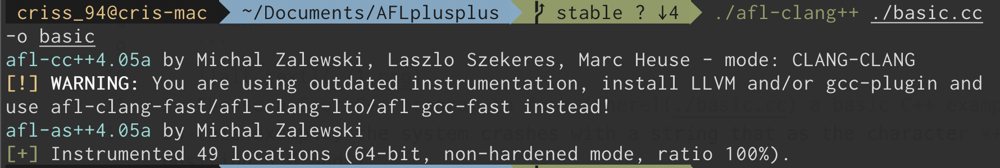
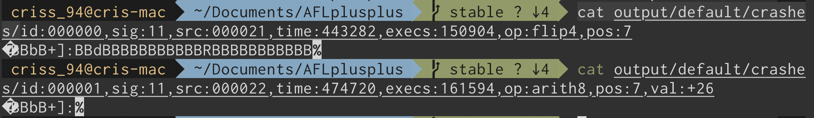

# 1. AFL++ for stateless systems

1. Download [AFL++](https://github.com/AFLplusplus/AFLplusplus) from the official GitHub repository
2. Build the tool:
     ```
   > cd $afl_repository
   > sudo ./afl-system-config
   > make
   ```
   
3. Choose a C or C++ program to fuzz ([here](./code/stateless_system.cc) a basic C++ example)
In this example, the system crashes with a string that is the character *+]:* in positions 5 6 and 7.
4. Create a seed file containing the character **a**:
    ```
    > mkdir input_stateless
    > echo "a" > input_stateless/seed.txt
    ```
5. Instrument the code:
    ```
    > ./afl-clang++ ./code/stateless_system.cc -o stateless_system
    ``` 
    
6. Run the fuzzer:
    ``` 
    > ./afl-fuzz -D -i input_stateless -o output ./code/stateless_system
    ``` 
    

7. Wait for a bug!
    

8. Let's take a look at the inputs obtained
    ```
    > cat output/default/crashes/
    ```
    
